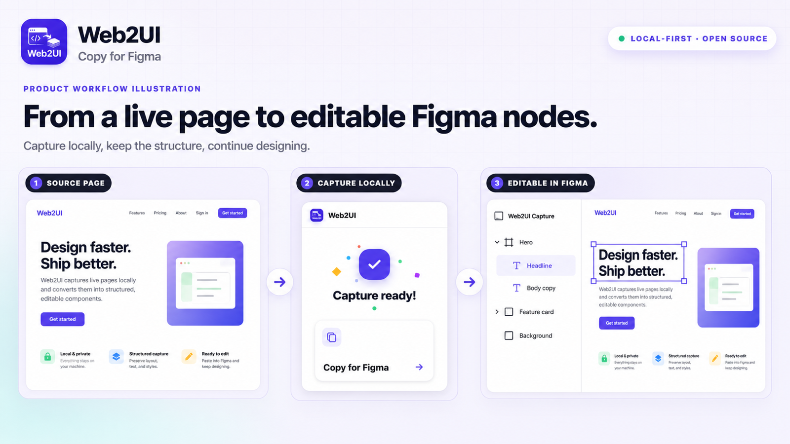

<p align="center">
  
</p>

<h1 align="center">Web2UI</h1>

<p align="center">
  <strong>Capture web pages locally. Paste ready-to-edit results into Figma.</strong>
  <br>
  A local-first, open-source Chrome/Chromium extension.
</p>

<p align="center">
  <a href="https://github.com/Lynavo/web2ui-extension/actions/workflows/ci.yml"></a>
  <a href="https://github.com/Lynavo/web2ui-extension/actions/workflows/codeql.yml"></a>
  <a href="https://github.com/Lynavo/web2ui-extension/releases"></a>
  
  
  <a href="./LICENSE"></a>
</p>

<p align="center">
  <a href="#product-preview">Product Preview</a> •
  <a href="#install">Install</a> •
  <a href="#open-source-boundaries">OSS Boundaries</a> •
  <a href="#commercial-edition">Commercial</a> •
  <a href="#architecture">Architecture</a> •
  <a href="#development">Development</a> •
  <a href="#contributing-and-support">Contributing</a>
</p>

---

Web2UI captures either the visible viewport or the full document, preserves visual structure and
editable text where possible, and prepares SVG/HTML clipboard data for Figma. Capture, conversion,
temporary storage, and clipboard preparation happen inside the browser.

There is no Web2UI account, hosted conversion service, upload flow, analytics, advertising, or
telemetry in this edition.

## Project status

Web2UI is implemented and release-validated as a standalone public extension. The project is
pre-1.0: its local-only and security boundaries are stable, while capture compatibility may
continue to evolve between minor releases.

| Surface | Current open-source scope |
| --- | --- |
| Browser | Chrome 106 or newer; release-tested with Chromium |
| Capture | Visible Area and Full Page |
| Environment | Browser or preset viewport; browser, light, or dark theme |
| Output | User-triggered clipboard payload for Figma |
| Processing | Local capture, conversion, and temporary storage |
| Network | Bounded reads of assets declared by the selected page; no Web2UI service |
| Distribution | Verified GitHub Release ZIP loaded as an unpacked extension |
| Support | Latest published release |

## Product preview



This GPT Image 2-generated product illustration explains the intended workflow and visualizes
layered, editable output. It is not a screenshot of the Figma application, a pixel-for-pixel
fidelity benchmark, or a promise of native Figma Frames, semantic layer names, Auto Layout,
components, or an exact document hierarchy. Real capture and clipboard behavior is validated
separately by the repository's MV3 E2E suite.

## Why Web2UI

Rebuilding a reference page manually is slow, while sending a private page to an unknown
conversion server may be inappropriate. Web2UI keeps the workflow inspectable and local:

- capture begins only after an explicit user action;
- page structure is measured and converted inside the extension;
- one bounded result is retained locally for no more than 24 hours;
- clipboard access occurs only after the user clicks **Copy for Figma**;
- captured page content is not sent to a Web2UI-operated server.

Web2UI is intended for design exploration, migration, and reference reconstruction. It prioritizes
visual similarity and basic editable text; it does not promise perfect conversion of every browser
feature or reproduce the full semantic model of a native Figma document.

## Key features

- **Visible Area capture** for the current browser viewport.
- **Full Page capture** with bounded scrolling and page-settling behavior.
- **Viewport presets** for Browser, 1920, 1440, 1024, 768, and 390 pixels.
- **Theme selection** using the browser preference or forced light/dark emulation.
- **Local asset recovery** for page-declared images, SVG, fonts, and CSS backgrounds.
- **Bounded single-frame raster fallbacks** for content that cannot be represented safely as
  editable vectors.
- **Editable text where possible**, carrying measured geometry, paints, effects, clipping, and
  stacking facts through the conversion pipeline.
- **Figma-friendly clipboard formats** using SVG, HTML, and plain-text fallbacks.
- **No remote executable code** and no runtime dependency on a Web2UI backend.
- **Verifiable releases** with SHA-256 checksums, an SPDX SBOM, and build provenance.

## Open-source boundaries

> [!IMPORTANT]
> **Local-first open-source extension**
>
> - Visible Area and Full Page capture work without an account or hosted service.
> - Capture, conversion, temporary storage, and clipboard preparation run in the browser.
> - HTTP(S) network requests are limited to bounded recovery of assets declared by the selected
>   page.
> - All executable release code is packaged with the extension and covered by release-boundary
>   tests.

> [!WARNING]
> **Not included in this repository**
>
> - Accounts, billing, quotas, hosted conversion, uploads, cloud storage, or remote access.
> - Analytics, telemetry, advertising, crash-reporting SDKs, or remote feature flags.
> - Remotely hosted executable code or runtime dependency on a developer-controlled server.
> - A Figma plugin runtime, native Figma component semantics, or automatic document insertion.
> - Chrome Web Store publishing, auto-update infrastructure, or store-submission materials.

## Commercial edition

This repository is the local-first, open-source edition of Web2UI. A hosted commercial edition is
also available at **[web2ui.lynavo.io](https://web2ui.lynavo.io/)** for people who want a managed,
end-to-end workflow.

The commercial product extends Web2UI with:

- URL, ZIP/HTML, and Chrome capture entry points;
- managed conversion jobs, accounts, usage quotas, and capture history;
- a Figma plugin workflow for importing prepared results;
- an expanded fidelity path for complex and dynamic pages, backed by managed cloud processing.

The hosted product is separate from this repository. No Web2UI account or commercial service is
required to install, build, modify, or use the open-source extension. The extension includes an
optional website link and may show it beside a local fidelity warning or complexity-related
failure. Following that link is always a separate user action: the extension does not upload the
capture, create an account, or send conversion data to the hosted product.

## Install

Web2UI is distributed through [GitHub Releases](https://github.com/Lynavo/web2ui-extension/releases)
as an unpacked extension package. It is not installed through the Chrome Web Store.

### Requirements

- Chrome 106 or newer
- A Figma desktop or web application that accepts the generated clipboard payload

Other Chromium browsers may work when they implement the same extension interfaces, but they are
not part of release validation. Firefox and Safari are not supported.

### Download and verify

1. Download both files for the same version:
   - `web2ui-extension-<version>.zip`
   - `web2ui-extension-<version>.zip.sha256`
2. Verify the archive:

   ```bash
   shasum -a 256 -c web2ui-extension-<version>.zip.sha256
   ```

3. Extract the ZIP into a permanent local directory.
4. Open `chrome://extensions`.
5. Enable **Developer mode** and select **Load unpacked**.
6. Choose the extracted directory containing `manifest.json`.

Do not move or delete the extracted directory while the extension is installed. Read
[INSTALL.md](INSTALL.md) for package verification, loading, and update instructions.

## Use Web2UI

1. Open the HTTP(S) page you want to capture.
2. Open Web2UI from the browser toolbar.
3. Choose **Browser** or a preset viewport width.
4. Choose the browser theme behavior or force **Light** or **Dark**.
5. Select **Visible Area** or **Full Page**.
6. Review any warnings after local conversion completes.
7. Click **Copy for Figma**.
8. Open Figma and paste into the target canvas.

Starting a capture replaces the previous result. Select **Clear local data** to delete the current
result immediately.

Browser-internal pages such as `chrome://`, the Chrome Web Store, some PDF viewers, and some
enterprise-managed pages do not allow extension injection and cannot be captured.

## Architecture

```mermaid
flowchart LR
    User["Explicit user action"] --> Popup["Extension popup"]
    Popup --> Worker["MV3 service worker"]
    Worker --> Content["Content runtime<br>active page"]
    Content --> Capture["CaptureDocument"]
    Capture --> Convert["Pure local conversion"]
    Convert --> Plan["Portable RenderPlan<br>IndexedDB: ≤25 MiB / 24 h"]
    Plan --> Clipboard["SVG + HTML + text<br>clipboard payload"]
    Clipboard --> Figma["User pastes into Figma"]
    Worker -. "bounded page-declared asset reads" .-> Page["Page origin / CDN"]

    classDef chrome fill:#edeaff,stroke:#6249e8,color:#181827;
    classDef core fill:#e8f8f4,stroke:#16a982,color:#181827;
    classDef data fill:#fff4d9,stroke:#d89c18,color:#181827;
    class Popup,Worker,Content chrome;
    class Convert core;
    class Capture,Plan,Clipboard data;
```



The service worker accepts capture messages only when the random run ID, Chrome tab ID, and
document ID all match the active session. Navigation, tab closure, debugger detachment, or a newer
capture invalidates the previous run. Temporary emulation, debugger attachment, capture markers,
hidden overlays, and scroll changes are cleaned up on success and failure paths.

| Module | Responsibility |
| --- | --- |
| Capture | Measures DOM, styles, geometry, paint order, text, fonts, and page-declared assets. |
| Contracts and conversion | Validates untrusted data and deterministically produces a portable RenderPlan and clipboard payload. |
| Extension runtime | Adapts MV3 messaging, debugger, storage, alarms, injection, and popup interfaces. |

See [docs/ARCHITECTURE.md](docs/ARCHITECTURE.md) for the runtime seams, contracts, persistence,
asset handling, cleanup behavior, and build boundary.

## Privacy and network behavior

Web2UI does not upload captured DOM, text, images, or results to a Web2UI-operated server.
Local-first does not mean fully offline: the service worker may request an HTTP(S) image, SVG,
font, or CSS asset declared by the selected page when the injected runtime cannot read it
directly. These requests omit credentials and referrer data and enforce byte and time limits.

The extension stores small interface preferences with Chrome extension storage and one validated
portable RenderPlan in IndexedDB. The result:

- is limited to 25 MiB;
- expires after 24 hours;
- is replaced when a new capture starts;
- can be removed immediately with **Clear local data**;
- is rejected and deleted on the next activation if its expiry alarm was delayed.

Read [PRIVACY.md](PRIVACY.md) for the complete data-handling statement and
[SECURITY.md](SECURITY.md) for the supported security boundary. Never include private captures,
credentials, cookies, personal information, or sensitive page content in a public issue.

## Permissions

The manifest intentionally requests only the interfaces needed by the local capture workflow.

| Permission | Purpose |
| --- | --- |
| `activeTab` | Limits page interaction to the active tab selected by the user. |
| `alarms` | Schedules deletion of the current result after its 24-hour lifetime. |
| `clipboardWrite` | Writes the generated payload after the user clicks **Copy for Figma**. |
| `debugger` | Applies temporary viewport/theme emulation and captures bounded screenshot fallbacks. |
| `scripting` | Injects the packaged capture runtime after an explicit capture action. |
| `storage` | Stores small interface preferences and current extension state. |
| `unlimitedStorage` | Allows one local RenderPlan of up to 25 MiB without relying on a small storage quota. |
| `<all_urls>` | Operates on the selected HTTP(S) page and recovers assets it declares, including cross-origin CDN assets. |

The `debugger` attachment may cause Chrome to display a browser banner during capture. Web2UI
detaches after completion, failure, navigation, tab closure, or an unexpected debugger detach.
Permission changes are treated as security-sensitive and enforced by repository tests.

## Known limits

| Limit | Current value |
| --- | ---: |
| DOM nodes per capture | 8,000 |
| Individual asset | 4 MiB |
| Total recovered inline assets | Approximately 18 MiB |
| Portable RenderPlan | 25 MiB |
| Screenshot fallback nodes | 12 |
| Stored results | 1 |
| Result lifetime | 24 hours |

Canvas, video, WebGL, unsupported SVG, very large assets, browser-only effects, unavailable fonts,
and rapidly changing pages use the `local-static-v1` profile. It takes at most one current-frame
sample for each attempted fallback region, attempts no more than 12 regions, does not converge
animation timelines or recover transparent layers from multiple screenshots, and may rasterize,
approximate, omit, or report the region as a warning. The clipboard output does not preserve native
components, variables, prototypes, or Auto Layout semantics.

## Troubleshooting

<details>
<summary><strong>View common installation, capture, and clipboard issues</strong></summary>

### Chrome cannot load the extension

Select the extracted directory that directly contains `manifest.json`, not the ZIP file or its
parent directory. Confirm that checksum verification passed and Chrome 106 or newer is running.

### Capture is unavailable

Open a normal HTTP(S) page and retry. Reload the target page after installing or updating the
extension.

### Chrome shows a debugger banner

This is expected while Web2UI applies temporary emulation or captures a screenshot fallback. The
extension detaches automatically when the capture finishes, fails, navigates, or is cancelled by
closing the tab.

### The result is incomplete or looks different

Review the capture warnings. Ensure lazy content is loaded, prefer a stable page state, and pause
animations before retrying. Browser-only effects and inaccessible resources may be approximated.

### Figma receives plain SVG text

Chromium versions differ in rich clipboard MIME support. Update Chrome, keep the popup focused
when clicking **Copy for Figma**, and paste directly into the Figma canvas.

### A previous result disappeared

Only one result is retained. It is replaced by a new capture, removed by **Clear local data**, and
expires after 24 hours. Web2UI cannot recover an expired or cleared result.

</details>

If a problem remains reproducible on the latest release, follow [SUPPORT.md](SUPPORT.md) and use a
minimal synthetic page instead of attaching private captured content.

## Development

### Technology

| Layer | Technology |
| --- | --- |
| Extension platform | Chrome Manifest V3 |
| Language | TypeScript 5.9 |
| Popup interface | React 19 |
| Build | esbuild |
| Local persistence | IndexedDB + Chrome extension storage |
| Unit and policy tests | Vitest + Node test runner |
| Browser validation | Playwright with a real MV3 extension runtime |
| Package manager | pnpm 10 |

### Quick start

Requirements: Node.js 24 or newer and pnpm 10.

```bash
git clone https://github.com/Lynavo/web2ui-extension.git
cd web2ui-extension
pnpm install --frozen-lockfile
pnpm validate
```

Load `dist/` through `chrome://extensions` with Developer mode enabled. Reload the extension card
after rebuilding.

<details>
<summary><strong>View developer commands and repository map</strong></summary>

### Commands

| Command | Purpose |
| --- | --- |
| `pnpm build` | Build the unpacked extension into `dist/`. |
| `pnpm typecheck` | Check TypeScript without emitting files. |
| `pnpm lint` | Run ESLint with zero warnings allowed. |
| `pnpm test` | Run policy/build tests and Vitest unit suites. |
| `pnpm e2e` | Exercise the real MV3 visible/full-page copy flow in Chromium. |
| `pnpm validate` | Run build, typecheck, lint, unit, E2E, and release-boundary gates. |
| `pnpm package` | Produce the verified ZIP, checksum, and SPDX SBOM under `out/releases/`. |
| `pnpm audit` | Check dependencies against the package advisory database. |

### Repository map

```text
src/core/capture/       Page measurement and capture helpers
src/core/contracts/     CaptureDocument and RenderPlan contracts
src/core/conversion/    Pure conversion and clipboard rendering
src/extension/          MV3 adapters, storage, state, messaging, and popup
tests/                  Unit, policy, packaging, and real-browser tests
scripts/                Build, verification, packaging, and SBOM tools
docs/                   Architecture and contributor documentation
```

</details>

Generated artifacts belong under `dist/` or `out/` and are never committed.

## Quality and releases

Every change is expected to pass production build, TypeScript, ESLint, policy tests, Vitest unit
tests, a real Chromium MV3 flow, and local-only release-boundary verification. GitHub also runs
dependency review and CodeQL.

Versions follow Semantic Versioning. Before `1.0.0`, minor releases may include compatibility
changes. A release aligns `package.json`, `manifest.json`, `CHANGELOG.md`, its `v<version>` tag,
and archive name.

GitHub Releases publish:

- `web2ui-extension-<version>.zip`;
- `web2ui-extension-<version>.zip.sha256`;
- a production-dependency SPDX 2.3 JSON SBOM;
- a GitHub build-provenance attestation.

See [CHANGELOG.md](CHANGELOG.md) for user-visible changes and
[docs/RELEASING.md](docs/RELEASING.md) for the maintainer procedure.

## Documentation

- [Architecture](docs/ARCHITECTURE.md)
- [Development guide](docs/DEVELOPMENT.md)
- [Testing guide](docs/TESTING.md)
- [Release guide](docs/RELEASING.md)
- [Installation guide](INSTALL.md)
- [Privacy policy](PRIVACY.md)
- [Security policy](SECURITY.md)
- [Support policy](SUPPORT.md)
- [Coding-agent instructions](AGENTS.md)

## Contributing and support

Contributions are welcome when they preserve the local-only product and security boundary. Before
starting a large behavioral or permission change, open an issue so its scope can be discussed.

- [Browse issues](https://github.com/Lynavo/web2ui-extension/issues)
- [Report a bug](https://github.com/Lynavo/web2ui-extension/issues/new?template=bug_report.yml)
- [Request a feature](https://github.com/Lynavo/web2ui-extension/issues/new?template=feature_request.yml)
- [Report a vulnerability privately](https://github.com/Lynavo/web2ui-extension/security/advisories/new)

Read [CONTRIBUTING.md](CONTRIBUTING.md), [CODE_OF_CONDUCT.md](CODE_OF_CONDUCT.md), and
[MAINTAINERS.md](MAINTAINERS.md) before contributing. Contributions use an
inbound-equals-outbound policy under AGPL-3.0-only; a pull request does not grant permission to
reuse the contribution under proprietary terms.

## License

Web2UI is licensed under [GNU Affero General Public License v3.0 only](LICENSE). Bundled dependency
notices are available in [THIRD_PARTY_NOTICES.md](THIRD_PARTY_NOTICES.md).

Figma is a trademark of Figma, Inc. Web2UI is an independent project and is not affiliated with,
sponsored by, or endorsed by Figma.
